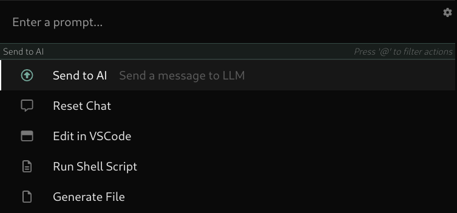

# Lightrail - The Universal AI Command Bar

    

## Description

Lightrail is an open-source AI command bar that seeks to simplifies software development. It is designed to be a general-purpose, extensible platform for integrating LLM-based tooling into engineering/development workflows. It does this by focusing on three components of working with LLMs: Providing sources of context, constructing effective prompts, and interfacing with external services. Lightrail accomplishes these goals through an extension framework called Tracks. Tracks can provide `Tokens`, which are sources of dynamically generated context for a prompt, as well as `Actions`, which are functions that can modify a prompt, send it to an LLM, and use the LLM's response to execute functionality. All Lightrail functionality is delivered via the Tracks system, so a plain install of the Lightrail Core is essentially nonfunctional. Therefore, Lightrail's default installation includes a few commonly used tracks (Chat, VSCode, Chrome). More tracks are in development and will be installable through the Lightrail application.

## Installation

Lightrail is currently pre-release, so installation requires a few steps. For VSCode and Chrome integration to function, the VSCode and Chrome extensions must be installed separately.

1. First, install the appropriate Lightrail Core package for your operating system:
   - OS X:
   - Ubuntu:
   - Fedora:
2. Install the VSCode Extension:
   1. hi
   2. hi
3. Install the Chrome Extension:
   1. hi
   2. hi

## Usage

- Launch Lightrail initially as you would normally start an application on your platform. Consider adding it to your startup items, so that it automatically starts on boot.
- When Lightrail is running on your system, it can be activated at any time by pressing the keyboard combination `Cmd/Ctrl-Shift-Space`.
- Enter text in the prompt, use the up- and down-arrow keys to select an action, and hit `enter/return` to send the prompt to the action.
- Type the forward-slash at any point in a prompt (`/`) to open the Tokens menu. Use the arrow keys to select a token and hit enter to insert that token into your prompt.
  - Tokens make it easy to pull in additional sources of context for your prompt. In general, try to be explicit about what sources of content you'd like to include for best results.

## Writing Tracks

_Documentation Coming Soon_

## Contributing

We'd love to have your contributions added to Lightrail! If you would like to contribute, please follow this guidelines:

- Fork the repository
- Create a new branch: `git checkout -b feature/my-feature`
- Make your changes
- Commit your changes: `git commit -m "Add new feature"`
- Push to the branch: `git push origin feature/my-feature`
- Submit a pull request

## License

This project is licensed under the MIT License. See the [LICENSE](./LICENSE) file for more details.
