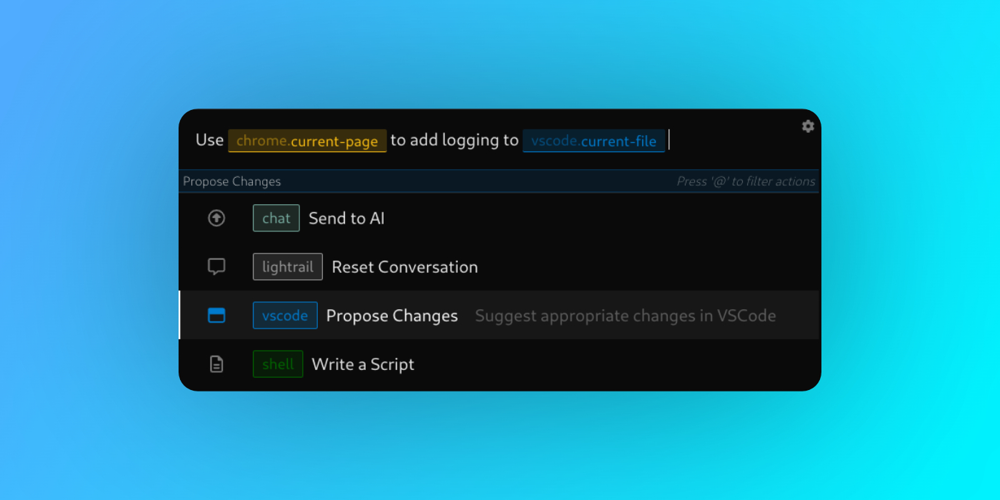

# Lightrail - The Universal AI Command Bar

    

[**Demo Screencast**](https://vimeo.com/861792302?share=copy) | [**Documentation**](https://docs.lightrail.ai)

## Description

🚧 Lightrail is currently pre-release - expect (and report) bugs / inconsistencies! 🚧

Lightrail is an open-source AI command bar that seeks to simplifies software development. It is designed to be a general-purpose, extensible platform for integrating LLM-based tooling into engineering/development workflows. It does this by focusing on three components of working with LLMs: Providing sources of context, constructing effective prompts, and interfacing with external services. Lightrail accomplishes these goals through an extension framework called Tracks. Tracks can provide `Tokens`, which are sources of dynamically generated context for a prompt, as well as `Actions`, which are functions that can modify a prompt, send it to an LLM, and use the LLM's response to execute functionality. All Lightrail functionality is delivered via the Tracks system, so a plain install of the Lightrail Core is essentially nonfunctional. Therefore, Lightrail's default installation includes a few commonly used tracks (Chat, VSCode, Chrome). More tracks are in development and will be installable through the Lightrail application.

## Installation

Lightrail depends on bridge extensions to interact with other software on your machine. To use the built-in VSCode and Chrome integrations, the VSCode and Chrome extensions must be installed separately.

1. **Download & install the appropriate Lightrail Core package for your operating system:**
   - OS X: [lightrail-core.dmg](https://github.com/lightrail-ai/lightrail/releases/latest/download/lightrail-core.dmg)
   - Ubuntu: [lightrail-core.deb](https://github.com/lightrail-ai/lightrail/releases/latest/download/lightrail-core.deb)
   - Fedora: [lightrail-core.rpm](https://github.com/lightrail-ai/lightrail/releases/latest/download/lightrail-core.rpm)
2. **Install the VSCode Extension:**
   1. Install this extension in VSCode: [https://marketplace.visualstudio.com/items?itemName=lightrail.lightrail-vscode](https://marketplace.visualstudio.com/items?itemName=lightrail.lightrail-vscode)
      - To do this, press ⌘/ctrl-p to open the VSCode Quick Open UI, then paste in the following command and hit Enter/Return: `ext install lightrail.lightrail-vscode`
3. **Install the Chrome Extension:**
   1. Download this file: [lightrail-chrome.zip](https://github.com/lightrail-ai/lightrail/releases/latest/download/lightrail-chrome.zip)
   2. Unzip `lightrail-chrome.zip`. It should contain a folder called `dist`.
   3. In Chrome, go to `chrome://extensions`. There should be a toggle in the upper-right labelled `Developer Mode`. Toggle it so that `Developer Mode` is enabled.
   4. Click the `Load unpacked` button, and select the `dist` folder (from step 2).
   5. Done! For more details / pictures, see: [https://developer.chrome.com/docs/extensions/mv3/getstarted/development-basics/#load-unpacked](https://developer.chrome.com/docs/extensions/mv3/getstarted/development-basics/#load-unpacked)

## Usage

- Launch Lightrail initially as you would normally start an application on your platform (i.e. from your application launcher). Consider adding it to your startup items ([OS X](https://support.apple.com/guide/mac-help/open-items-automatically-when-you-log-in-mh15189/mac), [Gnome](https://help.gnome.org/users/gnome-help/stable/shell-apps-auto-start.html.en)), so that it automatically starts on boot.
- When Lightrail is running on your system, it can be activated at any time by pressing the keyboard combination `Cmd/Ctrl-Shift-Space`.
- Use the up- and down-arrow keys to browse actions, and hit `enter/return` to select one (while in 'Choose an action' mode).
- To change the action afterwards, press `esc` or `@`, or click on the current action
- After selecting an action, enter the prompt (or any other required arguments). Your prompt can include tokens, which pull in additional context from external sources:
  - Type the forward-slash at any point in a prompt (`/`) to open the Tokens menu. Use the arrow keys to select a token and hit enter to insert that token into your prompt.
  - In general, try to be explicit about what sources of content you'd like to include for best results.
- `Cmd/Ctrl-Up` and `Cmd/Ctrl-Down` cycle through the prompt history.
- By default, the application uses a lightrail.ai-provided gateway to access OpenAI's LLMs. If you'd like to switch to using your own API key and accessing the OpenAI API directly, you can configure that in Settings (click the gear icon in the prompt input box).

## Troubleshooting

Some common issues, and how to fix them:

- **Q: I click on an action and I get `i is not iterable` as an error**
- **A:** This occurs when the action expects a prompt but one isn't provided. Almost all actions currently available only work if the user has entered a prompt. For example, to use the VSCode Propose Changes action, first type "refactor /vscode.current-file" as the prompt _then_ click the action.
- **Q: I'm on Linux and the keyboard shortcut to open Lightrail isn't working for me**
- **A:** If you're using Wayland, this is a known bug, caused by [this issue](https://github.com/electron/electron/issues/15863). Currently, the only fix is using your system's settings to manually assign a keyboard shortcut to launching Lightrail. If you have any idea how to work-around this bug, I'd love to hear it!

Any other issues? Let me know [on Discord](https://discord.gg/57bNyxgb7g) or [make an issue](https://github.com/lightrail-ai/lightrail/issues) and I'll address it ASAP!

## Writing Tracks

The `lightrail-sdk` npm package makes it easy to create additional tracks and extend lightrail's functionality.

- To get started, copy this project layout: [starter](https://github.com/lightrail-ai/lightrail/tree/main/tracks/starter)
- See this repository's [tracks](https://github.com/lightrail-ai/lightrail/tree/main/tracks) for example usage of the SDK (**More Documentation Coming Soon**)

## Contributing

We'd love to have your contributions added to Lightrail! If you would like to contribute, please follow this guidelines:

- Fork the repository
- Create a new branch: `git checkout -b feature/my-feature`
- Make your changes
- Commit your changes: `git commit -m "Add new feature"`
- Push to the branch: `git push origin feature/my-feature`
- Submit a pull request

## License

This project is licensed under the MIT License. See the [LICENSE](./LICENSE) file for more details.
