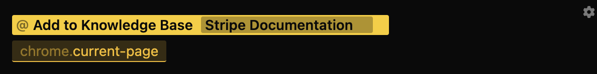

import { Callout } from "nextra/components";

### Chrome

> The Chrome Track requires Lightrail's Chrome Extension to be installed, to facilitate communication between Lightrail and Google Chrome. If you haven't already installed it, follow these directions:
>
> - Download this file: [lightrail-chrome.zip](https://github.com/lightrail-ai/lightrail/releases/latest/download/lightrail-chrome.zip)
> - Unzip `lightrail-chrome.zip`. It should contain a folder called `dist`.
> - In Chrome, go to `chrome://extensions`. There should be a toggle in the upper-right labelled `Developer Mode`. Toggle it so that `Developer Mode` is enabled.
> - Click the `Load unpacked` button, and select the `dist` folder (from step 2).
> - Done! For more details / pictures, see: [https://developer.chrome.com/docs/extensions/mv3/getstarted/development-basics/#load-unpacked](https://developer.chrome.com/docs/extensions/mv3/getstarted/development-basics/#load-unpacked)

You can input content from Google Chrome to Lightrail using the following Tokens:

- `/chrome.current-selection`: Any highlighted text
- `/chrome.current-page`: The most recent tab open

<Callout type="warning" emoji="⚠︎">
  Content ingested via the Google Chrome Tokens is subject to OpenAI's context
  length limit. If a webpage is too long to use `/chrome.current-page`, you can
  either select the relevant content using `/chrome.current-selection` or add
  the entire page to your local Lightrail knowledge base ([instructions
  here](/tracks/kb)).
</Callout>

### Recipes

1. **Send to AI**: Read in the contents of Google Chrome's current tab & ask Lightrail's LLM to summarize the current article
   
2. **Suggest Edits**: Use the contents of a webpage to make edits in your VSCode project
   
3. **Add to Knowledge Base**: If the contents of a webpage is too long for OpenAI's token limit, read in the page to your Lightrail Knowledge base for usage in future queries.
   
