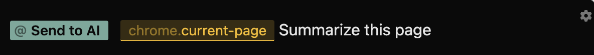

import { Callout } from "nextra/components";

### Chrome

<Callout type="info" emoji="ℹ️">
  Note: The Lightrail Chrome extension must be installed ([instructions here](/installation)). 
</Callout>

You can input content from Google Chrome to Lightrail using the following Tokens: 
 - `/chrome.current-selection`: Any highlighted text
 - `/chrome.current-page`: The most recent tab open 

<Callout type="warning" emoji="⚠︎">
  Content ingested via the Google Chrome Tokens is subject to OpenAI's context length limit. If a webpage is too long to use `/chrome.current-page`, you can either select the relevant content using `/chrome.current-selection` or add the entire page to your local Lightrail knowledge base ([instructions here](/tracks/kb)).     
</Callout>

### Recipes

1. **Send to AI**: Read in the contents of Google Chrome's current tab & ask Lightrail's LLM to summarize the current article

2. **Suggest Edits**: Use the contents of a webpage to make edits in your VSCode project

3. **Add to Knowledge Base**: If the contents of a webpage is too long for OpenAI's token limit, read in the page to your Lightrail Knowledge base for usage in future queries. 

