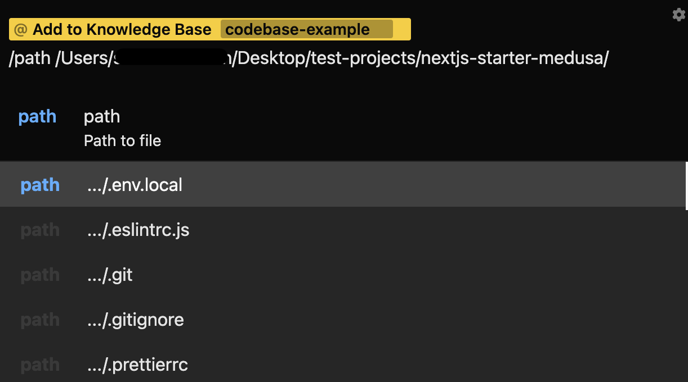
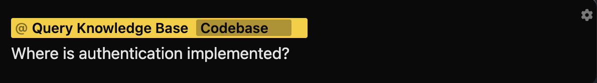
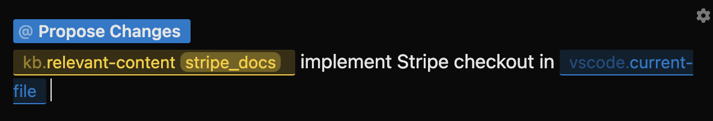

import { Callout } from "nextra/components";

### Knowledge Base

Each Lightrail instance comes with a local vector db. You can add arbitrary text content that exceed OpenAI's token limit for usage in future queries. By default, there are 2 Actions and 1 Token. 

**Actions**: 
1. `Add to Knowledge Base`: Add a file, a directory, or a webpage to your knowledge base. Give it a tag to reference the content in future queries. 

2. `Query Knowledge Base`: Ask a question referencing one of the previously tagged knowledge base content and get an answer.

**Tokens**: 
1. `/kb.relevant-content`: Reference one of the previously tagged knowledge base items for arbitrary queries for arbitrary queries. 

