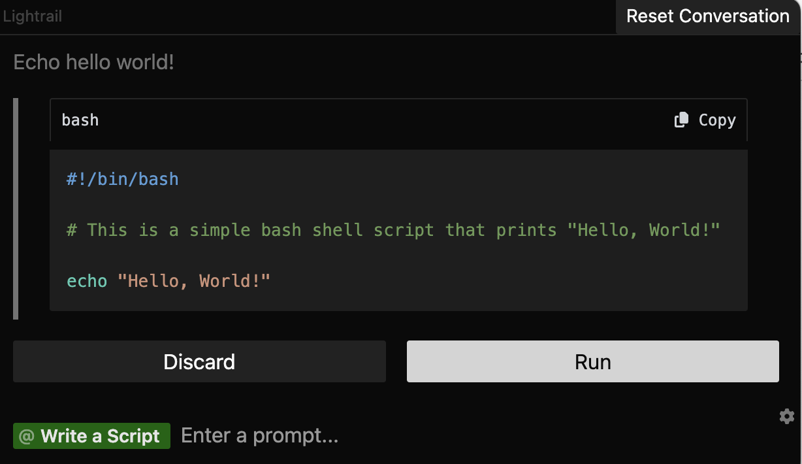

import { Callout } from "nextra/components";

### Shell

You can use Lightrail to quickly write & run Shell scripts with natural language. 

<Callout type="info" emoji="ℹ️">
  By default, all scripts will run in the directory where the Lightrail app is stored. 
</Callout>

### Recipe

**Run a simple Bash script from Lightrail**
 
