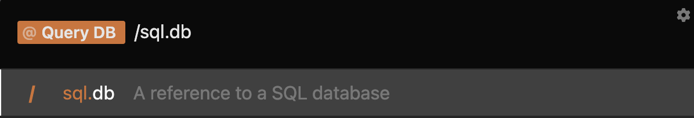
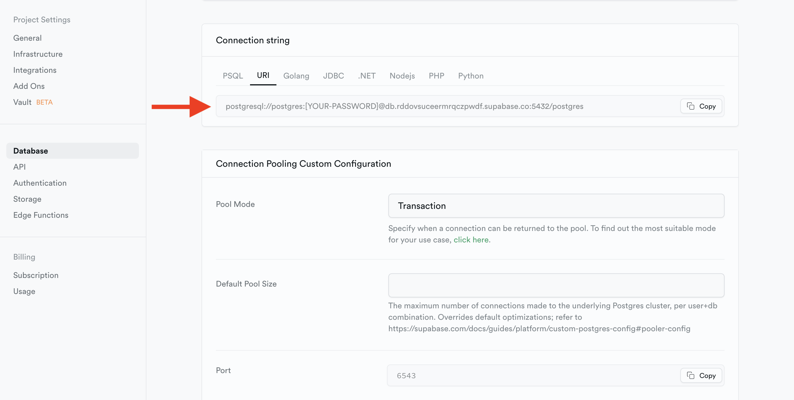
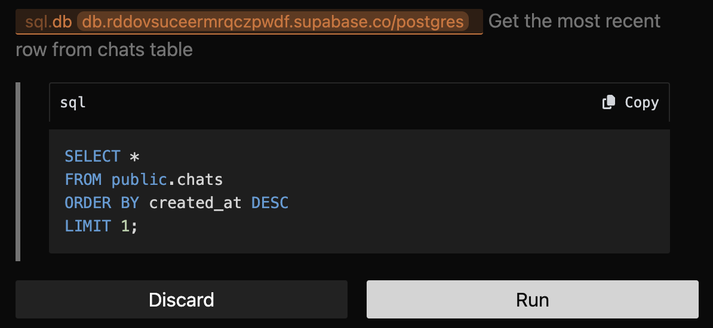
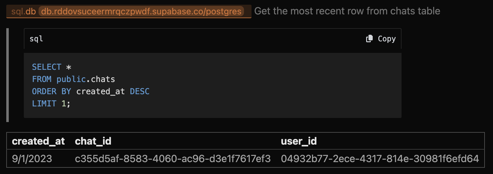

import { Callout } from "nextra/components";

## SQL 

Lightrail can also connect to a PostgresDB and run lightweight SQL queries. NoSQL databases are not supported at this time. 

**Action**: 
 1. `Query DB`: Write and optionally run a SQL query against a database. Needs to be used in conjunction with the SQL Tokens (`/sql.table` or `/sql.db`) & reference a database connection URL. 

 **Tokens**: 
 1. `/sql.table`: reference a specific table in the PostgresDB - requires a database connection URL.
 2. `/sql.db`: reference a PostgresDB - requires a database connection URL. 

 ### Recipe
Run a lightweight SQL query against your Supabase instance in Lightrail: 
 1. Select the `Query DB` Action 
 2. Reference the database that you would like run the query against with `/sql.db`
 
 3. Find the DB URL in Supabase & paste that into Lightrail
 
 4. Describe in natural language the query you would like to run 
 
 5. Run the SQL query 
 

